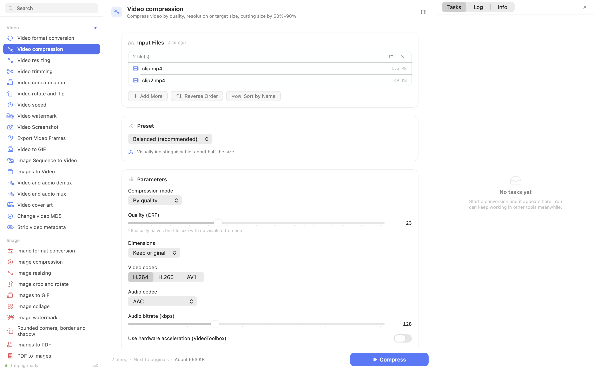

# FormatForge

A format converter for macOS. Videos, images, documents, archives — 53 tools in
one window, all running locally on your Mac.

I built this because I got tired of juggling five different command-line tools
and a handful of sketchy websites every time I needed to convert something. The
websites upload your files somewhere. The command-line tools each have their own
syntax to remember. So this is one app that does the lot, and never sends
anything over the network.



Video compression, with two files staged and an estimated output size on the run
bar. Every tool keeps its own inputs, so you can start a long encode here and
work in another tool while it runs.

---

## What it does

**Video** — convert between MP4/MOV/MKV/WebM/AVI, compress (by quality, target
size, or bitrate), resize, trim and split, join clips, rotate and flip, change
speed, add watermarks, grab screenshots or every frame, make GIFs, build videos
from image sequences or photo slideshows, split and merge audio, set cover art,
change a file's checksum without touching the picture, and strip metadata.

**Images** — convert between PNG/JPEG/HEIC/AVIF/WebP/TIFF/BMP/GIF/ICO/ICNS/PDF,
compress to a target size, resize, crop and rotate, build animated GIFs with
transitions, stitch collages, add watermarks, round corners with shadows, turn
images into a PDF, or pull a PDF apart into images.

**Documents** — Word ⇄ PDF ⇄ Markdown ⇄ plain text, plus RTF, HTML and
OpenDocument. Merge, split, compress and password-protect PDFs. OCR images and
PDFs into text or a searchable PDF.

**Archives** — create split, AES-256 encrypted ZIP or 7z archives, extract them,
or just look inside without unpacking.

**Utilities** — checksums (MD5, SHA-1, SHA-256, SHA-512, CRC32), change a file's
hash, batch rename, QR codes, and full image metadata including EXIF and GPS.

The app ships in **12 languages**: English, 简体中文, 繁體中文, 日本語, 한국어,
Français, Deutsch, Español, Português, Русский, Italiano and Nederlands. English
is the default; you can switch in Settings, and the change is instant.

---

## Requirements

- macOS 14 (Sonoma) or later
- Apple silicon or Intel — the release build is universal

That's it. **You do not need Homebrew, ffmpeg, or anything else.** The release
DMG bundles ffmpeg, ffprobe, 7z and cwebp inside the app.

If you're building from source and would rather use your own copies, install
them with:

```sh
brew install ffmpeg p7zip webp
```

The app looks for bundled tools first, then a custom path you set in Settings,
then the usual Homebrew and system locations.

---

## Building

### The quick way

```sh
git clone https://github.com/yourname/formatforge.git
cd formatforge
./build.sh
open build/FormatForge.app
```

`build.sh` figures out which SDK to use, compiles the app, generates the icon,
and assembles `build/FormatForge.app`. It takes about 20 seconds on an M-series
Mac. The script never launches the app — I got tired of windows popping up
mid-build.

### Building the DMG

```sh
./make-dmg.sh
```

This compiles a universal binary (arm64 + x86_64), downloads static ffmpeg and
ffprobe builds, bundles everything into the app, and produces
`build/FormatForge.dmg`. First run takes a few minutes because it downloads
about 60 MB of tools; later runs reuse the cache in `build/vendor/`.

Add `--arm64-only` to skip the Intel slice if you only care about Apple silicon.

### Running the tests

```sh
./test.sh
```

102 checks that run real conversions on real files and verify the results. Not
"does the file exist" but "is the output actually correct" — for example, that
changing a video's MD5 leaves the frame count identical, that a split archive
rejects the wrong password, and that compressing a video really does make it
smaller. Output lands in `.test/out/` so you can look at it yourself.

### There's a catch with the SDK

You need Xcode or the Command Line Tools installed. If you have the Command
Line Tools only, you may hit this:

```
error: failed to build module 'PDFKit'; this SDK is not supported by the compiler
```

That means your SDK and your compiler are from different builds. `build.sh`
handles it automatically by probing for a working SDK — it tries 26.5, 26,
15.4, 15, 14.5 and then whatever `xcrun` reports, and picks the first one that
compiles a SwiftUI probe. If none work, install the full Xcode, or point
`FORMATFORGE_SDK` at a good SDK:

```sh
FORMATFORGE_SDK=/path/to/MacOSX.sdk ./build.sh
```

---

## How it works

The app is plain SwiftUI with **no third-party Swift dependencies**. Everything
that can be done with system frameworks is: CoreGraphics and ImageIO for
images, PDFKit and CoreText for documents, Vision for OCR, CryptoKit for
hashes, Compression for deflate.

Only three things genuinely need external binaries — video encoding, 7z
encryption, and WebP output — and those are bundled in the release.

### Three kinds of tool

This is the design decision everything else follows from. Tools are not all the
same shape, so they don't all get the same UI:

| Kind | How it works | Examples |
|---|---|---|
| **Inspectors** | Drop a file in, results appear. No button, no queue, no save dialog. | Checksums, Image Info, Archive Contents |
| **Converters** | Pick a preset, tweak options, hit the button, watch the queue. | Everything that writes a file |
| **In-place** | Acts on the file directly. | Batch Rename, Change Hash |

I got this wrong at first — I made everything a converter, which meant
"calculate a checksum" asked you where to save the output. That's silly. So the
app now distinguishes them properly.

### Every tool has its own state

Each of the 53 tools keeps its own files, options, preset and output folder.
Switching tools doesn't wipe what you were doing, which means you can start a
long encode in one tool and go calculate a hash in another while it runs.

### Codec info is in the app

Pick a video codec and the app tells you what it's actually good for —
compatibility, compression, speed, and when you'd want it. No more guessing
whether HEVC is worth the compatibility risk for your use case.

### Hardware encoding is off by default

VideoToolbox is fast, but it produces noticeably bigger files at the same
visual quality. Since this is a conversion tool and file size usually matters
more than a few seconds of encode time, software encoding is the default. You
can turn it on per-tool, or globally in Settings. On a test clip, the default
gave 78% size reduction; hardware encoding gave noticeably less.

---

## Project layout

```
Sources/
├── App/          Window, sidebar, settings, global state
├── Design/       Colours, typography, components, form controls
├── Core/         Process handling, job queue, tool model, localisation,
│                 media probing, estimation, hashing, logging
├── Codecs/       GIF encoder (LZW + median-cut quantiser), WebP encoder
└── Features/
    ├── Video/    18 video tools
    ├── Image/    10 image tools
    ├── Document/ 17 document tools
    ├── Archive/  Create, extract, inspect
    ├── Inspect/  3 automatic inspectors
    └── ToolRegistry.swift
```

Roughly 15,000 lines of Swift across 45 files.

---

## Adding a tool

Tools declare themselves. You write a `Tool` value describing the inputs,
options and behaviour, and the UI builds itself:

```swift
static var tool: Tool { Tool(
    id: "video.compress",
    name: L("video.compress.name"),
    summary: L("video.compress.summary"),
    symbol: "arrow.down.right.and.arrow.up.left",
    category: .video,
    accepts: ["mp4", "mov", "mkv"],
    parameters: [
        .slider("crf", L("video.compress.param.crf.label"),
                default: 26, min: 14, max: 40, step: 1),
        .picker("scale", L("..."), default: "original", options: VideoOptions.scale),
    ],
    run: { context in
        // context.inputs, context.int("crf"), context.progress...
        return outputs
    }
) }
```

Note the `static var` rather than `static let`: a `static let` is evaluated once
and would freeze its translated strings in whatever language was active at first
access. Everything that calls `L()` is a computed property for that reason, and
`./test.sh` fails if a `static let` caches a translated string.

Options can declare when they're visible (`.visibleWhen(.equals("mode", "size"))`),
so a form only shows what's relevant. The registry picks up the new tool
automatically.

### Adding a language

Strings live in `Resources/i18n/<code>.json` as flat `key: value` maps, one per
language. To add one:

1. Copy `Resources/i18n/en.json` to `<code>.json`
2. Translate the values (leave the keys alone)
3. Add the language to the `Language` enum in `Sources/Core/Localization.swift`

```swift
case portuguese = "pt"
```

Then add its display name to `nativeName` (in that language) and `englishName`:

```swift
case .portuguese: return "Português"      // nativeName
case .portuguese: return "Portuguese"     // englishName
```

`./test.sh` verifies that every language has the same key set as English, so a
missed string fails rather than silently showing English.

### A note on language names

`nativeName` is deliberately **not** translated. A German user looking for
Chinese should see 简体中文, not "Chinesisch" — the whole point is that you can
find your own language in a list you might not be able to read.

### A layout note if you add a language

Translations are not all the same length. Spanish, Portuguese, German and
Russian run 2–3× the English, which broke two things when the languages first
landed:

- **Labels were clipped.** A segmented control cannot shrink or wrap, so
  "Preguntar cada vez" was cut off where "Ask" had fit. `SegmentPicker` now
  tries the segmented control and falls back to a menu when the labels do not
  fit — `ViewThatFits` does this without stealing width from its neighbours.
- **The action button was too narrow.** It was pinned to 148pt, which clipped
  186 translated titles — including the English "Take Screenshots". It now
  sizes itself from its label: 148pt minimum, 190pt maximum, and a label too
  long for that wraps onto a second line rather than widening further. 190pt is
  measured — it is the point where every action title in all 12 languages fits
  in two lines, so the button never needs a third.
- **The sidebar cut off tool names.** At 224pt, ten languages truncated. It is
  250pt now, and rows wrap to two lines and grow to fit rather than clipping.
- **The inspector was too narrow.** The three tabs needed 320pt in Russian, so
  at 300pt they collapsed to a menu. It is 380pt now, measured rather than
  guessed.

Every one of those numbers came from measuring the real strings with `NSFont`,
not from guessing. `Tests/LayoutTest.swift` now re-measures all 53 tool names,
action titles, parameter labels and picker options against their containers in
all 12 languages, so a new translation that does not fit fails `./test.sh`
instead of quietly getting cut off.

---

## Localisation

Twelve languages, about 1,180 strings each. The tooling in `Tools/i18n/` keeps
them in sync:

```sh
python3 Tools/i18n/assign-keys.py      # scan sources, assign keys
python3 Tools/i18n/rewrite-sources.py  # swap literals for L("key")
python3 Tools/i18n/build-resources.py  # emit Resources/i18n/*.json
```

A note on why there are no `.strings` files: with this many keys across this
many languages, the tables belong in data rather than in code, and JSON means a
translator can work without touching the build. It also lets the tests compare
key sets across languages programmatically.

---

## The tutorial

There's a long HTML walkthrough of the whole codebase at `docs/index.html` —
about 29,000 lines covering the architecture, why each piece is written the way
it is, the bugs I hit, and the full source.

```sh
./Tools/build-tutorial.sh
```

It is generated from the source, so it cannot drift out of date: the tool list
and parameters come from the live `ToolRegistry`, and code excerpts are read
straight out of `Sources/`.

The page ships in **five languages** — English (default), 简体中文, 日本語,
한국어 and Français — switched from the toolbar. All five live in the same file
as `data-lang` spans, so switching is instant, works from `file://`, and the
2.5 MB of source code is only stored once.

The prose lives in `Tools/tutorial/i18n/<code>.json`:

```sh
python3 Tools/tutorial/validate-content.py   # check every table is complete
python3 Tools/tutorial/split-chunks.py ja    # split one language for translation
python3 Tools/tutorial/merge-chunks.py ja    # merge the translated chunks back
```

`validate-content.py` compares each language against the Chinese source of
record and fails on a missing or extra key, so a gap shows up as a failed build
rather than a blank section in the page.

---

## Known limitations

- **The icon and screenshot are placeholders.** I drew the icon in about ten
  minutes. A better one would be very welcome — replace
  `Resources/AppIcon-source.png` and run `./Scripts/make-icon.sh`.
- **7z in the DMG is arm64 only.** Intel Macs fall back to a system install for
  encrypted archives. Everything else is universal.
- **Scanned PDFs need OCR.** If a PDF has no text layer, "PDF to Word" tells you
  so and suggests the OCR tool instead of writing an empty document.
- **AV1 encoding is slow.** It's software-only here. Fine for short clips,
  painful for anything long — use H.265 if you're in a hurry.
- **The app is ad-hoc signed.** It isn't notarised, so the first launch needs a
  right-click → Open. Notarising needs a paid Apple developer account.
- **I can't test Intel performance.** I only have Apple silicon, so the x86_64
  slice is verified to build and link but not benchmarked.

---

## A few implementation notes

Things that were non-obvious enough to be worth writing down:

**ffmpeg has no `drawtext` in the build I use** (no libfreetype), so text
watermarks are rendered with CoreText into a transparent PNG and composited with
`overlay`. Side benefit: proper CJK support and better antialiasing than
drawtext would have given.

**`hwaccel` is an input option.** Put it after `-i` and ffmpeg errors with a
message about the output file, which is confusing. It cost me an hour.

**Multi-input tools need to supply their own `-i` flags.** The shared encode
helper used to add one unconditionally, which shifted every input index for
tools like concat — the result was a 3-second video where a 6-second one was
expected.

**ffprobe reports a JPEG as a single-frame `mjpeg` video stream.** So "does this
have a video stream?" is not how you tell a photo from a movie. The app
classifies by extension and only falls back to stream inspection for ambiguous
containers.

**Collapsing code with `innerHTML` destroys syntax highlighting.** The tutorial
generator rebuilds collapsed blocks from `textContent`, which strips every
`<span>`. It's a CSS `max-height` now.

**Never make logic depend on translated text.** The UI used to pick a colour by
checking whether the label contained "减少". That works in Chinese and silently
breaks in eleven other languages. It switches on an enum now.

**A `[data-lang]` selector matches `<html>` too.** The tutorial's language
switcher hid its own root element, which made the whole page invisible while
every element-level check still passed. The test now walks ancestors and uses
`getClientRects()` instead of reading each element's own `display`.

---

## Licence

MIT. See [LICENSE](LICENSE).

Third-party components bundled in release builds:

| Component | Licence |
|---|---|
| ffmpeg / ffprobe | LGPL 2.1+ / GPL 2+ (depends on build flags) |
| 7-Zip (p7zip) | LGPL 2.1+ |
| libwebp (cwebp) | BSD 3-Clause |

Source builds don't include these; they use whatever you have installed.

---

## Contributing

Bug reports and pull requests are welcome. See [CONTRIBUTING.md](CONTRIBUTING.md).

If you're adding a tool, the pattern in `Sources/Features/` should make it
clear. If you're adding a language, the section above covers it — and the tests
will tell you if you've missed a string.

Before opening a PR, please run `./test.sh`. It catches most of the things that
have actually gone wrong in this project.

## Things I'd especially like help with

- **A better icon.** The current one is a placeholder I made in ten minutes.
- **Intel Mac testing.** I only have Apple silicon, so the x86_64 slice builds
  and links but has never been benchmarked.
- **Notarisation.** Right now the app is ad-hoc signed, which means users have
  to right-click → Open on first launch. That needs a paid Apple developer
  account, which I don't have.
- **Windows and Linux ports.** The core logic is fairly portable; the UI is
  SwiftUI, which isn't.
